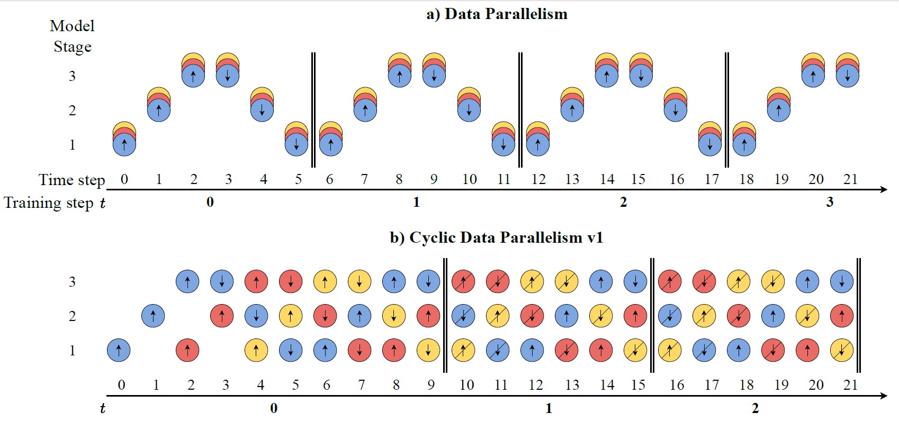

# Cylic Data Parallelism for Efficient Parallelism of Deep Neural Networks



## Introduction

This is the repository for the code for the paper "Cylic Data Parallelism for Efficient Parallelism of Deep Neural Networks"

The presented code can be used to train the three update rules considered for image classification on CIFAR10 and ImageNet on ResNets.

## Running instructions

To reproduce our experiments on ImageNet with 8 GPUs, use the following command, adapting for the update rule and model name.
```
python -u main.py \
       --n_epoch_if_1_worker 91 \
       --batch_size 32 \
       --lr 0.1 \
       --dataset_name ImageNet \
       --weight_decay 0.0001 \
       --split_n_stages 4 \
       --momentum 0.9 \
       --partition_strategy flops \
       --update_rule {DP/CDP1/CDP2} \
       --test_every_k_epochs 10 \
       --model_name {resnet18/resnet50} \
       --sched_gamma 0.1
```
To reproduce our experiments on CIFAR10 with 8 GPUs, use the following command.
```
python -u main.py \
       --n_epoch_if_1_worker 101 \
       --batch_size 64 \
       --lr 0.05 \
       --dataset_name CIFAR10 \
       --weight_decay {0.0005/0.001} \
       --split_n_stages 4 \
       --momentum 0.9 \
       --partition_strategy flops \
       --update_rule {DP/CDP1/CDP2} \
       --test_every_k_epochs 10 \
       --model_name {resnet18/resnet50} \
       --sched_gamma 0.2
```
